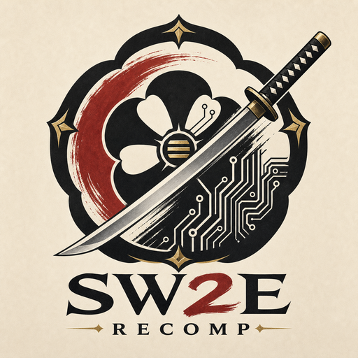

# SW2E Recomp



SW2E Recomp is a ReXGlue-based PC recompilation project for the Xbox 360 release of
*Samurai Warriors 2: Empires*. The current focus is a playable PC runtime, runtime hooks, modding
support, file-format documentation, and a project-side native-renderer path that can eventually own
presentation and graphics features directly.

This repository does not include game assets, disc images, XEX files, movie files, or extracted
archives. You need your own legally obtained copy of the game data.

## Game Background

*Samurai Warriors 2: Empires* is an Omega Force / Koei action-strategy Empires title. Public listings
identify the Xbox 360 version as a February 27, 2007 North American release, developed by Omega
Force and published by Koei. The Empires structure mixes battlefield action with campaign strategy,
scenario selection, officer management, and territory control.

References:

- [GameFAQs listing](https://gamefaqs.gamespot.com/xbox360/937212-samurai-warriors-2-empires)
- [Amazon product listing](https://www.amazon.com/Samurai-Warriors-2-Empires-Xbox-360/dp/B000MAFXTQ)
- [Worthplaying 2007 review/info page](https://worthplaying.com/article/2007/3/2/reviews/40197-xbox-360-review-samurai-warriors-2-empires/)

## Current Status

- Boots into menus and gameplay on the current PC runtime.
- Boot movie files can be disabled to avoid the early black-screen/movie path while runtime work
  continues.
- Mouse and keyboard support is wired through runtime hooks; `W/A/S/D` map to movement and mouse
  actions can map to attack-style inputs.
- Save/storage crashes and controller-driven freezes have runtime hook coverage in the current build.
- Loose-file mod overlay support exists through `--mod_data_root`.
- `LINKDATA_BNS.IDX/LNK`, LZP2 packing, stage bundles, G1M/G1MG geometry, and archive ranges are
  documented under `docs/`.
- Native-renderer sidecar work can observe draw/swap events, hash or dump bounded guest memory,
  classify render-state buckets, and replay supported title/menu draw families through a native
  D3D11 path.
- The opt-in projected-gap replay can now submit selected gameplay transform-gap families through
  D3D11 debug-fit output, including the first confirmed tiled `k_8_8_8_8` render-target texture
  fetch family, the repeated D5 stride-9 terrain/ground strip shader family, and the first
  promoted 1C9E and 1B2E indexed stride-11 shared-skin projection families.
- Standard native replay now also supports the DE7 constant-selector screen-space quad family that
  covers a large gameplay UI/effect bucket. This is visibility scaffolding for native gameplay
  rendering, not the final camera/shader path.
- Native replay also carries depth state and can submit the first no-color depth rectangle family
  into a native D3D11 depth target without letting depth-only passes own visible presentation.

Full native gameplay rendering is not complete yet. The next big graphics milestone is correlating
indexed `triangle_strip` battle draws and stride-8/9/10 vertex layouts with decoded G1M meshes,
materials, constants, and render-target ownership.

## Repository Layout

| Path | Purpose |
| --- | --- |
| `src/hooks` | Runtime hooks, function naming, input/storage/movie/archive/file instrumentation. |
| `src/native_renderer` | SW2E project-side native-render event sink and D3D11 replay experiments. |
| `generated` | ReXGlue-generated recomp sources. Do not hand-edit these files. |
| `docs/recomp_findings.md` | Running engineering log of boot/runtime/native-render findings. |
| `docs/runtime_hooks.md` | Hook map and runtime behavior notes. |
| `docs/modding_support.md` | Archive, G1M, stage, weapon, character, and Blender-facing modding notes. |
| `docs/native_renderer_plan.md` | Native-renderer plan, validation notes, and next graphics milestones. |
| `docs/debug_dev_tooling_modding_priorities.md` | Compact debug/dev-tooling leads and high-value IDA/modding priorities. |
| `docs/external_tooling.md` | Public Koei/Omega Force tooling references and repo hygiene notes. |
| `tools` | Extractors, converters, summaries, G1M OBJ export/patch tooling, and IDA label helpers. |
| `mods/loose` | Local loose-file override root used by launch scripts. |

## Requirements

- Windows 10/11.
- Visual Studio 2026 Insiders or another Visual Studio toolchain with the MSVC environment scripts.
- CMake 3.25 or newer.
- Ninja.
- ReXGlue SDK 0.8.0. Either install the SDK package so CMake can find it, or pass
  `-DREXSDK_DIR=<path-to-rexglue-sdk-source>`.
- A legally obtained Xbox 360 game dump extracted into a local `game_files` folder.

## Build

From a Visual Studio developer shell:

```powershell
cmake --preset win-amd64-debug -DREXSDK_DIR=L:\SM2\thirdparty\rexglue-sdk-source-v0.8.0
cmake --build out/build/win-amd64-debug
```

The local validation command used during development is:

```powershell
cmd.exe /d /c 'call "C:\Program Files\Microsoft Visual Studio\18\Insiders\VC\Auxiliary\Build\vcvars64.bat" >nul && "C:\Program Files\CMake\bin\cmake.exe" --build out/build/win-amd64-debug'
```

## Run

The default local launcher expects game data at `L:\SM2\game_files`:

```powershell
.\run_recomp.bat
```

Useful launchers:

- `run_recomp.bat` starts the playable runtime with the current hook set.
- `run_recomp_visible_cursor.bat` keeps the host cursor visible for debugging.
- `run_recomp_native_events.bat` enables bounded native-render event capture.
- `run_recomp_native_gameplay_capture.bat` keeps giant JSON logs off by default and captures bounded
  priority samples for indexed, strip, model-layout, and multi-texture gameplay draws.
- `run_recomp_native_transform_probe.bat` runs a muted, timed gameplay probe with JSON events off and
  reports concise `SW2E native transform gap` lines for the next native-renderer work.
- `run_recomp_native_gap_sample_probe.bat` captures a bounded gap-only `samples.jsonl` plus vertex,
  index, and texture bytes for unsupported native gameplay draws.
- `run_recomp_native_projected_gap_replay.bat` writes an opt-in native D3D11 debug BMP for selected
  gameplay transform-gap draws without enabling the large JSON event stream. Pass
  `-ProjectedGapMode constant-fit` to test the current constant-projection path with visibility
  normalization, `-ProjectedGapMode constant` for the strict unnormalized projection check, or
  `-ProjectedGapMode shader-final-fit` to test the dumped-shader final projection block.
  `-ProjectedGapMode shader-bone0-final-fit` adds the first upstream shader matrix block
  (`c4-c6`) before the final projection. `-ProjectedGapMode shader-skinned-final-fit` reads the
  dumped-shader weight/index inputs and applies the indexed `c[4+a0]..c[6+a0]` palette block before
  the final projection. The underlying PowerShell probe also accepts `-ProjectedVertexShader`,
  `-ProjectedPixelShader`, `-ProjectedGapMinIndices`, and `-DumpShaders` for focused shader-family
  analysis.
- `tools\apply_rexglue_native_render_wide_constants.ps1` patches a source ReXGlue SDK checkout so
  the native-render event stream captures up to 128 float constants per draw instead of 8. Use this
  with the local source SDK when working on gameplay shader transforms.

## Modding Direction

The modding path is intentionally SW2E-specific:

- `LINKDATA_BNS` archive cataloging and patching.
- Stage bundle mapping for scenario/map work.
- G1M/G1MG geometry export to OBJ for Blender inspection.
- Conservative OBJ-to-G1M patching for position/normal/UV edits while preserving topology.
- Future Blender importer/exporter work for stage and map editing.

See `docs/modding_support.md` for the current file-format map.
See `docs/external_tooling.md` for Project-G1M and other public tooling references used for
cross-checking.

Current support snapshot:

| Area | Status |
| --- | --- |
| Playable runtime | Boots into menus/gameplay with current runtime hooks. |
| Loose-file overlay | Available through `--mod_data_root` and `mods\loose`. |
| `LINKDATA_BNS` catalog/repack | Tooling exists for cataloging, dry-run rebuilds, and patched archive previews. |
| `LZP2` | Decode and literal encode tooling exists. |
| `G1M` geometry | OBJ export and topology-preserving OBJ-to-G1M patching exist for known SW2E samples. |
| `G1TG` textures | Runtime BC3 capture/decode is proven; archive-side texture editing still needs more validation. |
| Animation | Identified as `G1A_`, not yet a finished edit/import path. |
| Native renderer | Title/menu native D3D11 replay works; gameplay mesh projection is experimental. |

## Native Rendering Direction

The native-renderer code is a sidecar first, replacement renderer later. Today it can:

- Observe live ReXGlue draw/swap events without editing generated recomp code.
- Classify visible/no-output/depth/indexed/layout/texture buckets.
- Capture bounded guest vertex, index, and texture memory samples.
- Convert bounded native gap samples into simple OBJ previews and compact CSV projection reports with
  `tools/export_native_gap_obj.py`.
- Decode linear BC3/DXT5 menu textures.
- Replay supported title/menu textured and solid draw families through D3D11.
- Replay selected gameplay transform-gap meshes through an experimental D3D11 debug-fit path.
- Dump compact ReXGlue shader ucode files by hash during short no-JSON probes.
- Capture wider shader constant windows from a source ReXGlue SDK checkout for transform work.
- Replay promoted projected-transform gameplay families as standard
  `supported_projected_transform` draws, including the `D5CCD0C915DDCC0B` stride-9 direct
  `c7..c10` terrain/ground-strip path and the `1C9E2812AEBDBE4E` indexed stride-11 shared-skin
  `c[4+a0]..c[6+a0]` plus `c0..c3` projection path. The `1B2E9C6960B0C86E /
  D10452A3E31F9C61` stride-11 character/weapon family is also promoted through its direct
  `c[15+a0]..c[17+a0]` skin block and `c11..c14` projection block.
- Replay the `DE7F9AF93C668314 / 8CBAD34FCE165328` constant-selector quad family by reading the
  selector stream and captured `c7..c18` position/color/UV constants.
- Replay the first no-color depth rectangle family into a native D3D11 depth target while guarding
  visible presentation ownership.
- Capture full supported native replay passes at swap with
  `--sw2e_native_renderer_gpu_replay_draw_limit=0`, so gameplay frames are not artificially capped
  to small title/menu batches during ownership testing.
- Keep the compatibility renderer as the reference path while native coverage grows.

Near-term work:

- Capture battle/gameplay priority samples without multi-GB JSON logs.
- Map stride-8/9/10 vertex layouts, indexed triangle strips, shader constants, and shader transforms.
- Correlate runtime draws with decoded G1M stage, character, weapon, and material records.
- Own render targets and final presentation.
- Add native graphics options such as MSAA/post-AA after render targets are owned.

## Legal Notes

This project is for research, preservation, interoperability, and modding of a game you own. It does
not ship proprietary game assets, copyrighted artwork from the game, disc images, XEX binaries, or
movie files. The generated project logo in `assets/` is original artwork for this repository and is
not an official Koei Tecmo asset.
